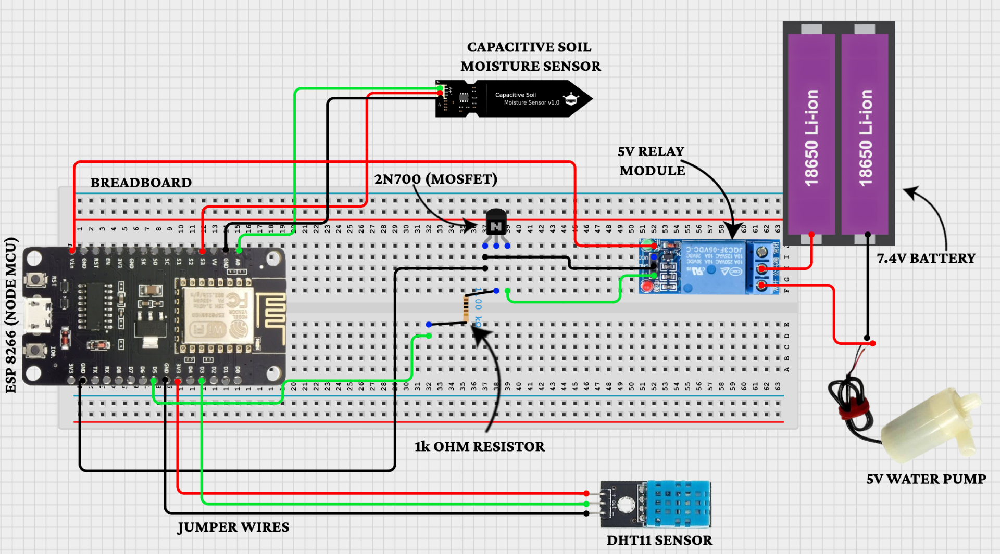

# 🌿 Smart Plant Monitoring System

An **IoT-based smart plant care system** that automates irrigation and monitors soil moisture, temperature, and humidity using an ESP8266 (NodeMCU). This project allows **remote access** via the Blynk IoT app for live tracking and control, ensuring healthier plants with reduced manual effort.

---

## 📌 Table of Contents
- [Features](#features)
- [Project Overview](#project-overview)
- [Components Used](#components-used)
- [Circuit Diagram](#circuit-diagram)
- [System Workflow](#system-workflow)
- [Implementation Details](#implementation-details)
- [Setup Instructions](#setup-instructions)
- [Results and Findings](#results-and-findings)
- [Future Enhancements](#future-enhancements)
- [License](#license)

---

## 🚀 Features

- 🌡️ **Environmental Monitoring**: Measures soil moisture, temperature, and humidity in real-time.
- 💧 **Smart Irrigation**: Automatically waters plants when soil moisture is low.
- ☁️ **Cloud Connectivity**: Live data sync using the Blynk IoT platform.
- 📱 **Mobile App Alerts**: Real-time updates and manual override via smartphone.
- 💡 **Efficient Decision Making**: Threshold-based control and hysteresis logic for optimal watering.

---

## 📖 Project Overview

The system addresses the inefficiency of manual plant care through automation. It collects environmental data using sensors and triggers a submersible pump when soil moisture drops below a set threshold. Designed for **home gardens**, **indoor plants**, or **greenhouses**, it enhances water conservation and plant health.

---

## 🧰 Components Used

| Component                  | Description                                              |
|---------------------------|----------------------------------------------------------|
| **ESP8266 NodeMCU**       | Main microcontroller for logic and Wi-Fi connectivity    |
| **Capacitive Soil Sensor**| Measures soil moisture without corrosion                 |
| **DHT11**                 | Monitors temperature and humidity                        |
| **5V Relay Module**       | Activates water pump based on sensor input               |
| **2N7000 MOSFET**         | Switches 5V relay with 3.3V logic                        |
| **1kΩ Resistor**          | Protects MOSFET gate                                     |
| **5V Submersible Pump**   | Provides water to plant when triggered                   |
| **Li-ion 7.4V Battery**   | Powers the pump                                          |
| **Blynk IoT App**         | Cloud-based dashboard for monitoring and control         |
| **Breadboard & Jumper Wires** | Prototyping connections                             |

---

## 🖼️ Circuit Diagram



This diagram illustrates the full wiring setup between the ESP8266, sensors, relay, and pump.

---

## 🔄 System Workflow

1. **Read sensor values** from soil sensor and DHT11.
2. **Compare against thresholds**.
3. If soil is dry:
   - Relay triggers the pump.
   - Water is supplied for 2–5 seconds.
4. All data is sent to the **Blynk dashboard**.
5. Manual override is available from the mobile app.

---

## 🛠️ Implementation Details

- **Platform**: Arduino IDE + Blynk Cloud
- **Connectivity**: Wi-Fi (2.4GHz, IEEE 802.11 b/g/n)
- **Programming**: C++ (Arduino)
- **Libraries**:
  - `ESP8266WiFi.h`
  - `DHT.h`
  - `BlynkSimpleEsp8266.h`

**Key Algorithm**:
- **Threshold-based automation** (e.g., pump triggers when moisture < 30%)
- **Hysteresis**: Cooldown delay of 5 seconds after each watering
- **Virtual Pins (V0–V4)**: Used in Blynk for sensor updates and control

---

## ⚙️ Setup Instructions

### 1. Clone this repository
```bash
git clone https://github.com/binay-tripathy/Smart-Plant-Monitoring-System.git
```

### 2. Open in Arduino IDE
Open the `NodeMCU_Code/NodeMCU_Code.ino` file.

### 3. Install Required Libraries:
- ESP8266WiFi
- Blynk
- DHT sensor library

### 4. Configure Wi-Fi & Blynk
Inside the `.ino` file:

```cpp
char auth[] = "YourBlynkAuthToken";
char ssid[] = "YourWiFiSSID";
char pass[] = "YourWiFiPassword";
```

### 5. Upload Code
- Select **NodeMCU 1.0 (ESP-12E Module)** as the board.
- Connect via USB and upload.

---

## 📊 Results and Findings

| Metric | Result |
|--------|--------|
| Response Time | 8 seconds (avg.) |
| Blynk Update Delay | 1.2 seconds |
| Pump Activation | 2–5 seconds per cycle |
| Real-time Alerts | Working via Blynk app |
| Environmental Tolerance | Operates in humid conditions |

---

## 🔮 Future Enhancements

- Replace DHT11 with DHT22 for better accuracy.
- Add NPK sensors for soil nutrition monitoring.
- Use solar panels for outdoor deployments.
- Integrate machine learning for predictive watering.
- Backup logging to SD card in case of Wi-Fi failure.

---

## 📜 License

This project is licensed under the [MIT License](LICENSE)
